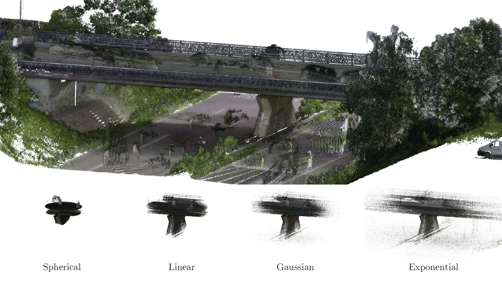

<div align="center">
<h1>From Spherical to Gaussian: A Comparative Analysis of Point Cloud Cropping Strategies in Large-Scale 3D Environments</h1>

[](https://arxiv.org/abs/2605.02098)

</div>

Large-scale 3D point clouds can consist of billions of points. Even after downsampling, these point clouds are too large for modern 3D neural networks. In order to develop a semantic understanding of the scene, the point clouds are divided into smaller subclouds that can be processed. Typically, this division is done using spherical crops, resulting in a loss of surrounding geometric context. To address this issue, we propose alternative methods that produce subclouds with larger crop sizes while maintaining a similar number of points. Specifically, we compare exponential, Gaussian, and linear cropping methods with the spherical method. We evaluated two 3D deep learning model architectures using multiple indoor and outdoor environment datasets. Our results demonstrate that altering the cropping strategy can enhance model performance, especially for large-scale outdoor scenes, yielding new state-of-the-art results. The different crops (each with ~240k points) investigated in are shown in the following:



# Getting started

This repository contains the simplified main part of the code for the aforementioned work. If you want to develop, make use of the devcontainer structure. If you want to run the code, build it and use the container.

The container so far misses the following:
```bash
cd lib
./setup.sh
```

If you want to use [LitePT](https://github.com/prs-eth/LitePT) make sure to select the right GPU architecture. Have a [look](https://arnon.dk/matching-sm-architectures-arch-and-gencode-for-various-nvidia-cards/) and change accordingly in lib/pointrope/setup.py

Train or run the models by using the main scripts:
```bash
python3 train.py config/<filename.yaml>
```

For linting and tests:
```bash
pylint common tests
pytest
```

# Citation

# Acknowledgement

We would like to thank all the contributors to [Pointcept](https://github.com/Pointcept/Pointcept) for their excellent work.